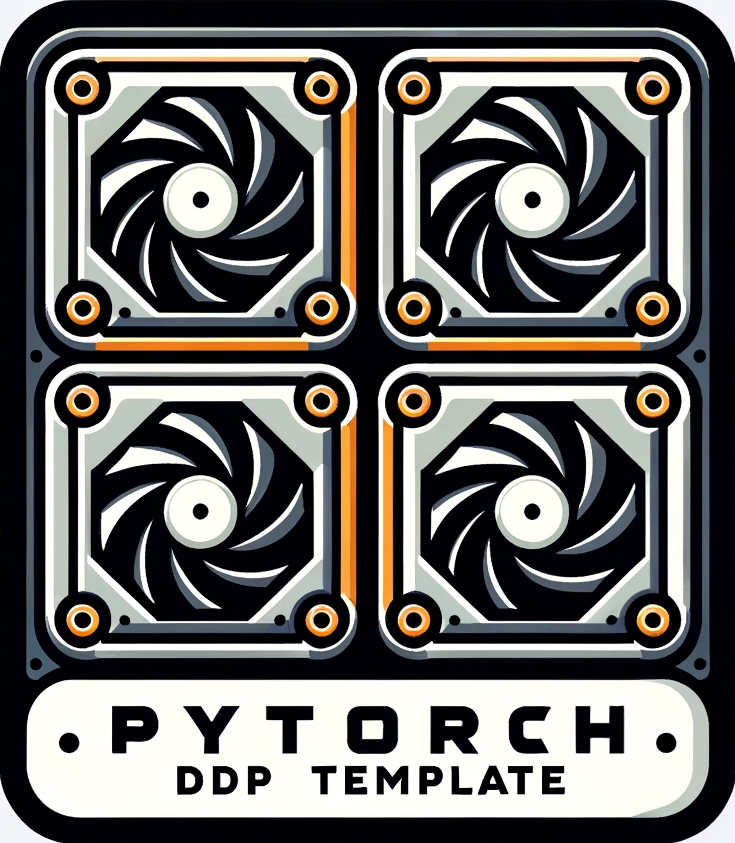

 

  

  <h3 align="center">
    A simple yet extendable distributed data parallel (DDP) template
  

## About
This is a ready-to-go template for training neural networks using PyTorch with distributed data parallel (DDP). The training and evaluation scheme is highly based on the <a href="https://github.com/pytorch/examples/blob/main/imagenet/main.py">official example on ImageNet</a>.

The main purpose of this repository is to help beginners learning, training, and testing on multiple GPUs properly. It also should be helpful to non-professionals who need to take the advantages of multiple GPU but struggle to write the code of a whole project.

Don't worry if you don't have stable accessibility to multiple GPUs. You can simply set NumOfGPU to 1 to run it on a single GPU. Additionally, becuase some networks/injectors may not compatible with DDP, scripts for single GPU without using DDP are also included.

Currently, the code is still a little "hard" as it mainly works for classification tasks. You are free to modify it to suit your need. The injector interface for customed metric calculation may be introduced in the future.

(<a href="#readme-top">back to top</a>)

## Usage and features

### Usage

A simple workflow can be:

1. Implement your dataset in Dataset.py
2. Implement your network in Network.py and the initialization in Train.py
3. Set the configuration in Train.py/Test.py
4. Run the script!

### Features
1. Scripts for single/multiple GPU training;
2. Dataloaders for MNIST, CIFAR-10/CIFAR-100, ImageNet and TinyImageNet;
3. Simple path management for data and results;
4. Logging and result saving;
5. A detailed discussion about evaluation with DDP in Trainer.py;

(<a href="#readme-top">back to top</a>)

## Environment
The code was tested in CentOS Linux 7 and Windows 11 with Anaconda enviroment.
- python 3.10.12
- pytorch 2.0.1
- cuda-runtime 11.7.1
- torchvision 0.15.2

(<a href="#readme-top">back to top</a>)

## License
Distributed under the MIT License. See `LICENSE` for more information.

(<a href="#readme-top">back to top</a>)

